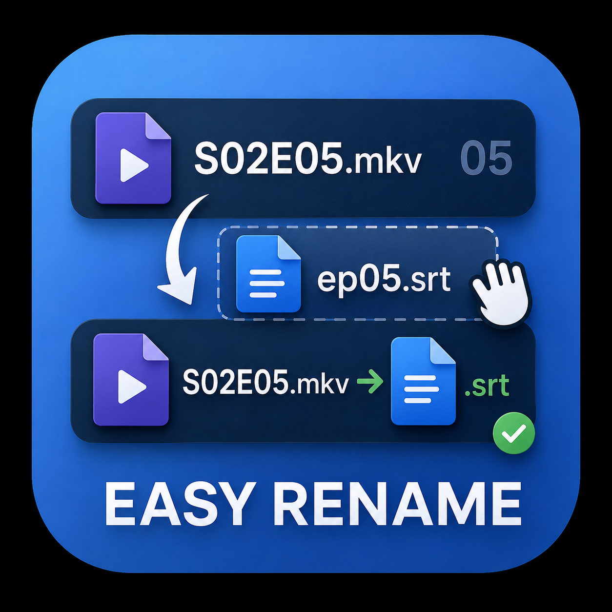

<p align="center">
  
</p>

<h1 align="center">Easy Rename</h1>

<p align="center">
  A fast, drag-and-drop desktop tool for renaming files — match subtitles to videos by episode number,
  <br />or run a Search &amp; Replace across a whole folder. Built with Tauri, React &amp; TypeScript.
</p>

<p align="center">
  <a href="https://github.com/ach-raf/easy-rename/releases"></a>
  
  &nbsp;
  
  
  
  
  &nbsp;
  
</p>

<!-- TODO: capture and drop a real screenshot, e.g. docs/screenshot-main.png
<p align="center">
  
</p>
-->

> [!NOTE]
> Easy Rename is a native desktop app. The Rust backend only lists directories and performs / undoes renames — **all matching logic is pure TypeScript and unit-tested.**

## Links

- [Highlights](#highlights)
- [Features](#features)
- [Install](#install)
- [Usage](#usage)
- [Command-line use](#command-line-use)
- [Develop](#develop)
- [Architecture](#architecture)
- [Contributing](#contributing)
- [License](#license)

## Highlights

- **Three rename modes** — match subtitles to videos by episode number, Search & Replace anything, or Renumber absolute-numbered files to `SxxEyy` across seasons.
- **Frictionless pairing** — a searchable subtitle picker that hides already-assigned files, per-row ✕ unlink, 🔒 lockable manual overrides, and a one-click **Auto-assign all** / **Unassign all** menu.
- **Safe by default** — live `old → new` preview, conflict detection (Skip / Overwrite), Windows device-name & illegal-character validation, and one-click **Undo last** batch.
- **Pure, tested logic** — pattern extraction, matching, and rename planning live in framework-free TypeScript covered by Vitest.
- **Tiny trusted surface** — the Rust side does only filesystem listing and rename/undo; nothing else.
- **Depth Design system** — a layered, OKLCH-based elevation language with light/dark themes and an accent hue picker.
- **Remembers your setup** — last-used patterns, inputs, and mode are auto-saved and restored on launch.
- **Scriptable** — pass a folder as a CLI argument to jump straight into it.

## Features

| Feature                                       | Match subtitles | Search &amp; Replace |
| :-------------------------------------------- | :-------------: | :------------------: |
| Regex pattern extraction                      |       ✅        |          ✅          |
| Independent per-side patterns                 |       ✅        |          —           |
| Auto-detect best pattern from filenames       |       ✅        |          —           |
| Episode index shift (fix off-by-one)          |       ✅        |          —           |
| Drag-and-drop pairing                         |       ✅        |          —           |
| Searchable subtitle picker (hides used)       |       ✅        |          —           |
| Lock manual pairings across re-match          |       ✅        |          —           |
| Bulk auto-assign / unassign all               |       ✅        |          —           |
| Literal &amp; regex replace                   |        —        |          ✅          |
| Case-sensitive toggle                         |        —        |          ✅          |
| Target filename / extension / both            |        —        |          ✅          |
| Conflict detection (Skip / Overwrite)         |       ✅        |          ✅          |
| Windows filename &amp; device-name validation |       ✅        |          ✅          |
| Live preview (old → new)                      |       ✅        |          ✅          |
| Undo last batch                               |       ✅        |          ✅          |
| Remember last-used inputs &amp; mode          |       ✅        |          ✅          |
| Drag-and-drop folder _or_ CLI argument        |       ✅        |          ✅          |

**Match subtitles to videos** — Drop a folder; videos and subtitles are split by extension. Pick a regex with one capturing group to extract each file's episode index, auto-match them, drag to fix any mismatches, and rename every subtitle to match its video — keeping the subtitle's own extension.

**Search & Replace** — Run a literal or regex search/replace across every file in a folder. Toggle case sensitivity, choose whether to touch the name, the extension, or both, and review the full preview before committing.

**Renumber (absolute → SxxEyy)** — For libraries that use absolute episode numbering. Pick the regex that extracts the absolute number, then for each season pick the first and last file and type the episode the first file should become. The app derives the offset and renames every file in range to `SxxEyy`, keeping the rest of each filename. Define multiple seasons to renumber a whole series in one pass; files outside every season's range are left untouched.

## Install

Download the latest Windows installer from the [Releases](https://github.com/ach-raf/easy-rename/releases) page and run the NSIS setup (`Easy Rename_0.1.0_x64-setup.exe`).

Prefer building it yourself? See [Build a Windows installer](#build-a-windows-installer).

## Usage

### Match subtitles to videos

1. **Drop a folder** (or click to browse). Files are split into videos and subtitles by extension; everything else is ignored.
2. **Pick a regex pattern** with one capturing group that extracts the episode index from each filename. Presets: `(\d+)`, `E(\d+)`, `S\d+E(\d+)`, `-(\d+)`. Use the **shift** offset to correct off-by-one numbering.
3. **Auto-match** pairs subtitles to videos by index. Tweak any row from its **subtitle picker** — type to search; already-assigned files are hidden so you can't double-assign. Click ✕ to unlink a row, or 🔒 **lock** a hand-picked pair so it survives Auto-detect / re-match. The header **⋯** menu offers **Auto-assign all** (fill empty rows) and **Unassign all** (start fresh). You can also drag subtitles between rows.
4. **Review the rename preview** (`old → new`) and click **Rename**. **Undo last** reverts the most recent batch. On-conflict policy: **Skip** or **Overwrite**.

**Example** — videos `ep1.mkv … ep26.mkv` + subtitles `ep01.srt … ep26.srt` with pattern `(\d+)`:

- `ep1.mkv` ↔ `ep01.srt` (both extract index `1`) → subtitle renamed to `ep1.srt`
- `ep26.mkv` ↔ `ep26.srt` → subtitle renamed to `ep26.srt`

The subtitle keeps its own extension, so `.ass` subtitles become `ep1.ass`, `ep2.ass`, … matching their video.

### Search & Replace

1. **Drop a folder** to load its files.
2. Enter a **search** string and a **replacement** — literal, or regex (with capture-group support).
3. Toggle **case sensitivity** and pick the scope: **name**, **extension**, or **both**.
4. Review the live preview, resolve any conflicts, and click **Rename**. **Undo last** reverts.

## Command-line use

Pass a folder as the first argument to launch straight into it — useful for automation (e.g. a script that processes one season at a time):

```bash
"Easy Rename.exe" "F:\Shows\Major\Season 2"
```

The app opens with that folder already loaded, exactly as if you'd dropped it. A missing path or a file (rather than a folder) is ignored, so the app falls back to the empty dropzone. Each launch is an independent window.

## Develop

Requires [Node.js](https://nodejs.org/), [pnpm](https://pnpm.io/), and [Rust](https://www.rust-lang.org/) (for the Tauri backend).

```bash
pnpm install
pnpm tauri dev               # run the desktop app with hot reload (http://localhost:1420)
pnpm test                    # Vitest unit tests (TypeScript matching logic)
pnpm test:watch              # …in watch mode
cd src-tauri && cargo test   # Rust command tests
```

| Script             | What it does                             |
| :----------------- | :--------------------------------------- |
| `pnpm dev`         | Vite dev server only (frontend, no Rust) |
| `pnpm build`       | `tsc` type-check + Vite production build |
| `pnpm preview`     | Preview the production build locally     |
| `pnpm tauri dev`   | Full desktop app, hot reload             |
| `pnpm tauri build` | Build the Windows installer              |

### Build a Windows installer

```bash
pnpm tauri build
```

Produces the raw `easy-rename.exe` binary at `src-tauri/target/release/` and an NSIS installer `Easy Rename_0.1.0_x64-setup.exe` under `src-tauri/target/release/bundle/nsis/`.

## Architecture

Easy Rename keeps the trusted surface tiny. **All business logic — classification, pattern matching, rename planning, search/replace — is pure TypeScript** with unit tests. The Rust backend is deliberately minimal: it lists directories and performs or undoes renames, and persists user preferences. Nothing more.

**Stack:** Tauri 2 · React 19 · TypeScript 5.8 · Vite 7 · @dnd-kit · Vitest · a custom Depth Design system (`src/styles/depth.css`).

```text
easy_rename/
├─ src/                  # React + TypeScript frontend
│  ├─ components/        # Dropzone, PairList, SubPicker, PatternPanel,
│  │                     #   RenamePanel, SearchReplacePanel, SearchReplaceList,
│  │                     #   StrayList, ThemeControls, Topbar, FilePath, icons
│  ├─ lib/               # Pure, unit-tested business logic
│  │  ├─ classify.ts     #   split files into videos / subtitles
│  │  ├─ match.ts        #   pattern extraction + pairing
│  │  ├─ renamePlan.ts   #   build the rename operation batch
│  │  ├─ renumber.ts     #   absolute → SxxEyy engine (season blocks)
│  │  ├─ searchReplace.ts#   the search/replace engine
│  │  ├─ path.ts         #   path helpers
│  │  ├─ theme.ts        #   theme management
│  │  └─ __tests__/      #   Vitest specs
│  ├─ styles/            # depth.css — Depth Design tokens
│  ├─ api.ts             # Tauri command bindings
│  └─ App.tsx            # mode switching + layout (rail / search-replace)
├─ src-tauri/            # Rust backend — list dir, rename, undo, persist
├─ design-mockups/       # HTML/CSS mockups of the UI layouts
└─ public/               # icons & static assets
```

## Contributing

Contributions are welcome. The cleanest place to add behavior is usually the pure TypeScript under `src/lib/` — write a failing Vitest case first, then implement. For changes that touch the filesystem, extend the Rust commands in `src-tauri/`.

```bash
git clone https://github.com/ach-raf/easy-rename.git
cd easy-rename
pnpm install
pnpm tauri dev
```

## 🧑‍💻 Contributors

<a href="https://github.com/ach-raf/easy-rename/graphs/contributors">
  
</a>

## License

Released under the [MIT License](LICENSE). A `LICENSE` file should live at the repository root.
